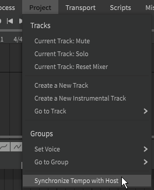

# DAW Integration

!!! note "Pro Feature"

    The features described below require Synthesizer V Studio Pro.

You can use Synthesizer V Studio Pro in a DAW (digital audio workstation) software as a VSTi or AudioUnit plugin.

Refer to your DAW's user manual for instructions on adding a plugin to your DAW and routing plugin output.

## Project Saving

When Synthesizer V Studio is used as an instrument in a DAW, an additional setting is added under the "File" top menu.

If "Save Inside Host" is selected, the Synthesizer V Studio project (SVP) file will be embedded within the DAW project.

To save an external SVP file separate from your DAW project, select "Save to External File" instead. However, "Save Inside Host" for some reason automatically gets deactivated, and you will have to manually reactivate "Save Inside Host".

!!! warning "Saving to an External File"

    Synthesizer V Studio cannot differentiate between a user-initiated save and an autosave performed by the host DAW. When saving to an external SVP, the SVP file will be updated any time the host performs a save of any kind. This is a limitation of the VST plugin standard.

## Synchronize Tempo with Host

An additional setting is added under the "Project" top menu.

By selecting "Synchronize Tempo with Host", tempo markers will be added to the Synthesizer V Studio project matching those of the DAW's project. Due to DAWs handling tempo changes in a variety of ways, this function may behave differently depending on the host software.

## Output Channels

The output of Synthesizer V Studio can be routed to one or many channels based on the option chosen in the Settings Panel. This allows you to apply different effects to each track while using Synthesizer V Studio as a plugin.

Master Combined
: A single channel is used for all audio output.

Master Aspiration Isolated
: Two channels are used, one for the phonation of all tracks and a second for the isolated aspiration of all tracks.

Track Combined
: One channel is used for each track.

Track Aspiration Isolated
: Two output channels are used for each track, one for the phonation and the other for the isolated aspiration.

!!! note

    Selecting an "Aspiration Isolated" option will remove the aspirant sounds from the main output, resulting in a base that only contains phonation. In this case the outputs must be recombined in the mixing process to have a complete result.

## Video Demonstration

<iframe width="560" height="315" src="https://www.youtube-nocookie.com/embed/jMm7piaJ0ss" title="YouTube video player" frameborder="0" allowfullscreen></iframe>

## Troubleshooting

If you encounter technical issues with the plugin, try removing the software and reinstalling to the default installation directory.

If the problems persist, search for similar issues on the [official forums](https://forum.synthesizerv.com/search) or contact [Dreamtonics support](../support.md).

---

[Report an Issue](https://github.com/claire-west/svstudio-manual/issues/new?template=report-a-problem.md&title=[Page: DAW Integration])
