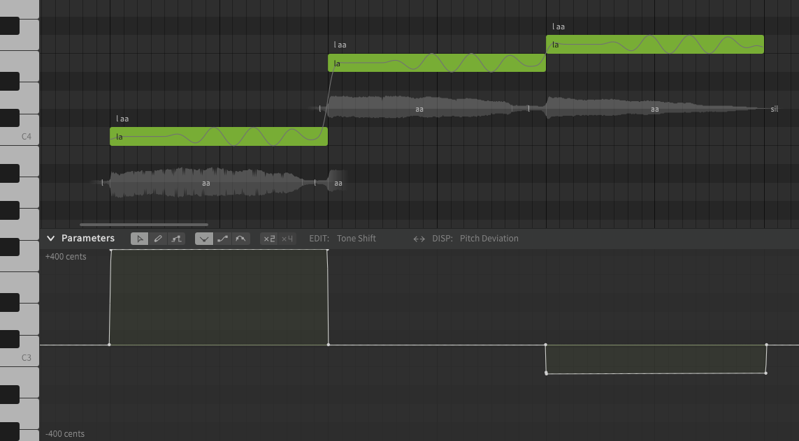

# Tone Shift

!!! note "Pro Feature"

    The features described below require Synthesizer V Studio Pro.

Tone Shift is a [parameter](editing-parameters.md) that allows modifying the tone of a note without changing its pitch.

The rendered output will have a tone as if the note were `x` cents different from the pitch line, where `x` is the value of the Tone Shift parameter at that point in time. Tone Shift is only applicable to AI voice databases.

In the example below, the pitches of the notes are C4, E4, and F4, with tone shift settings aligned exactly with the notes. The first two notes are 400 cents apart, and the second two are 100 cents apart. To match this, the tone shift settings used are approximately +400 cents, 0, and -100 cents.

During rendering, pitches of the notes are C4, E4, and F4 (as shown by the pitch line in the piano roll, with some minor variation due to vibrato), however the <i>tone</i> is calculated as if all three notes were E4 due to the tone shift values.

This can help mitigate any tonal inconsistency (or introduce more tonal variation) without modifying the pitch of the rendered output.

!!! info

    The effects of Tone Shift will vary based on the selected  voice database and pitch of the notes, because each vocalist's tone is different at different ranges.

---

[Report an Issue](https://github.com/claire-west/svstudio-manual/issues/new?template=report-a-problem.md&title=[Page: Tone Shift])