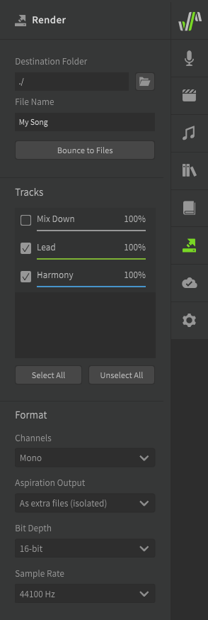

# Saving the Audio

The audio output can be exported to a wav file via the Render panel, accessible from the launch bar.

Give your files a name, select the tracks to render, and press "Bounce to Files" to export in wav format.

Additional format settings are also available, such as bit depth and sample rate.

!!! note "Pro Feature - Aspiration Output"

    Synthesizer V Studio Pro can isolate and export separate files for aspiration (the sounds produced by airflow). The aspiration can then be mixed differently in your DAW, or used as a reference when de-essing.

    Selecting an "isolated" aspiration option will remove the aspirant sounds from the main channel/file, resulting in a base file that only contains phonation (the sounds produced by the vocal cords). In this case the files must be recombined in the mixing process to have a complete result.

    While mixing vocals created in Synthesizer V Studio is largely the same as working with human vocals, the ability to work with aspiration separately from phonation allows for some unique possibilities.

    Using an isolated aspiration track allows de-essing without any risk of affecting the phonation component, or applying less reverb to the aspiration component to place more spacial emphasis on vowel sounds than on potentialy harsh consonant sounds. When combining the two components, the vocals can also be made to sound more crisp or mellow by adjusting the gain of the aspiration relative to the phonation. Care should be taken not to reduce the aspiration too much, or the result can easily lose clarity.

## Video Demonstration

<iframe width="560" height="315" src="https://www.youtube-nocookie.com/embed/upBn5tuzBg0" title="YouTube video player" frameborder="0" allowfullscreen></iframe>

---

[Report an Issue](https://github.com/claire-west/svstudio-manual/issues/new?template=report-a-problem.md&title=[Page: Saving the Audio])